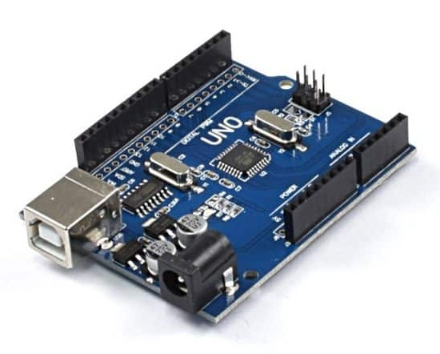
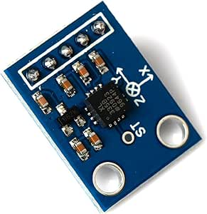
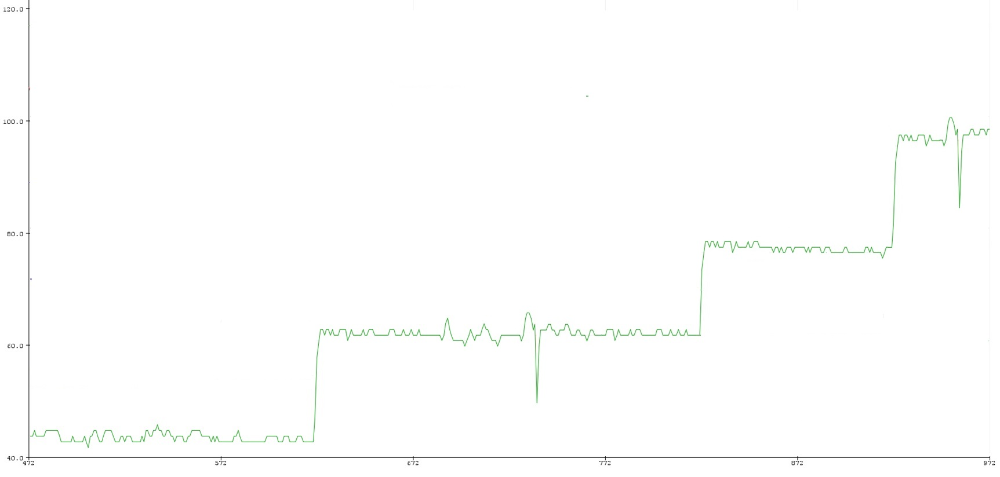

# Digital Kymograph Data Acquisition System
Arduino-based data-acquisition prototype for digitizing mechanical stylus movement from an analogue kymograph setup.

The system uses an Arduino Uno and an ADXL335 three-axis accelerometer. The accelerometer is mechanically coupled to the kymograph stylus so that stylus motion can be sampled and streamed to a computer for visualization and later analysis.


## Project overview

Traditional kymographs record physiological movement mechanically on a rotating drum. This prototype replaces the paper-based trace with digital sensor acquisition.

The Arduino reads the ADXL335 accelerometer's X, Y and Z analogue outputs and sends the raw values over serial communication as tab-separated samples.

## Hardware

* Arduino Uno
* ADXL335 three-axis accelerometer
* Analogue kymograph / organ-bath experimental setup
* USB serial connection to a computer

## Pin connections used

| Arduino Uno pin | Connection                            |
| --------------- | ------------------------------------- |
| A3              | ADXL335 X-axis output                 |
| A2              | ADXL335 Y-axis output                 |
| A1              | ADXL335 Z-axis output                 |
| A4              | Sensor ground, controlled in software |
| A5              | Sensor power, controlled in software  |

## Firmware behavior

* Serial baud rate: `9600`
* Output format: `X	Y	Z`
* Nominal sampling interval: `100 ms`
* Nominal sample rate: approximately `10 Hz`

Example serial output:

```text
523	487	612
524	489	611
526	491	614
```

## Repository structure

```text
digital-kymograph/
├── src/
│   └── kymograph_data_acquisition.ino
├── assets/
│   ├── arduino-uno.jpg
│   ├── adxl335-accelerometer.jpg 
│   ├── metal-rotating-drum.jpg 
│   ├── flowchart.jpg
│   ├── converntional-kymograph-system.jpg
│   ├── experimented-sample.jpg
│   ├── arduino-experimentation.jpg
│   └── example-response-trace.jpg
└── README.md
```

## Running the firmware

1. Connect the ADXL335 sensor using the pin mapping above.
2. Open `src/kymograph_data_acquisition.ino` in the Arduino IDE.
3. Select **Arduino Uno** as the board.
4. Select the correct serial port.
5. Upload the sketch.
6. Open the Serial Monitor at `9600` baud.
7. Capture the tab-separated X, Y and Z samples for plotting or analysis.

## Experimental evidence

### Arduino and accelerometer interface




### Conventional kymograph reference apparatus


### Example recorded response trace



## Limitations and future work

This repository preserves the Arduino data-acquisition component and selected experimental evidence from the wider project.

Current limitations include raw ADC output rather than calibrated acceleration units, sensitivity to sensor placement and mechanical coupling, and the absence of filtering, timestamping, and automated plotting within the firmware.

Future improvements could include sensor calibration, digital filtering, timestamped acquisition, CSV logging, automated plotting, and improved mechanical mounting.

## Publication

S. U. Ahmed, A. M. Saqlain, M. H. Mredul, M. Alimullah, A. Rahman, and M. A. Alam, “Digitization of an Analog Kymograph,” *2024 3rd International Conference on Advancement in Electrical and Electronic Engineering (ICAEEE 2024)*, IEEE, 2024.

## Scope

This repository contains the Arduino data-acquisition code and selected project evidence that can be shared publicly. It does not include the full publication PDF, raw experimental data, or the complete original analysis workflow.
